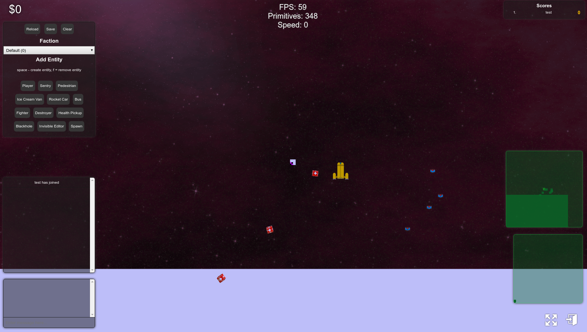
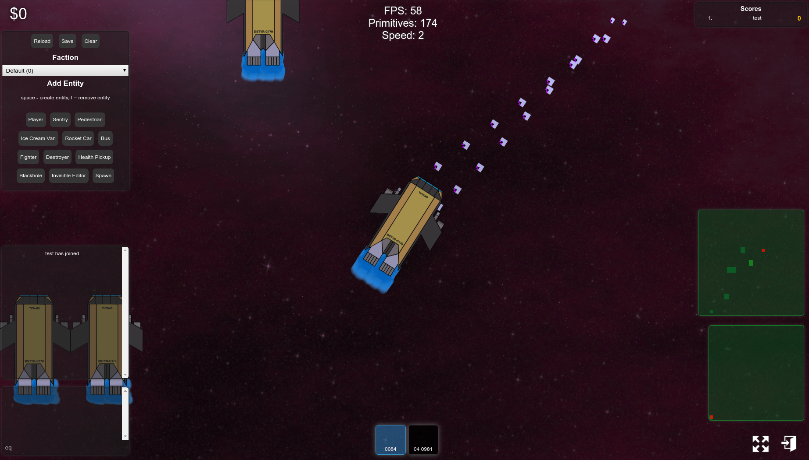
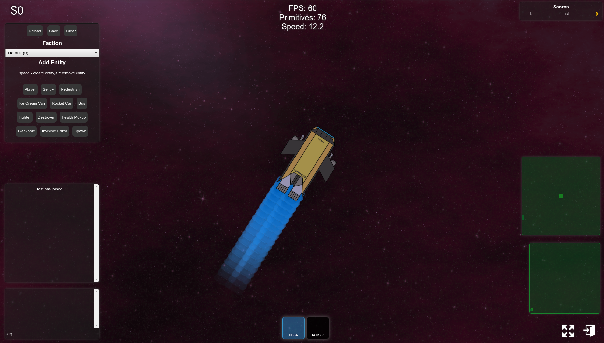

# project sandbox

<table>
    <tr>
        <td>
            
        </td>
        <td>
            
        </td>
        <td>
            
        </td>
    </tr>
</table>

An open world (well space) WebGL engine and game, with a backend using web sockets for comms.

This project was just for fun over a long span of time. It's incomplete, but learned a lot.

## Getting Started

* Setup database; `cd components/databases` and `./upgrade.sh`
* Startup website; `./run-tomcat-maven.sh`
* Startup server; run `com.projectsandbox.components.server.Program`
* Visit `http://localhost:8020/website` in browser

